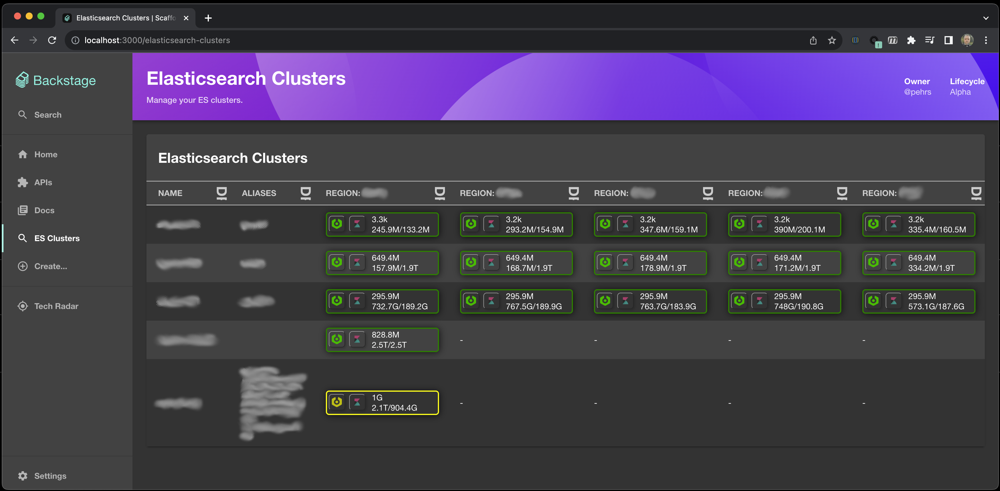

# backstage-elasticsearch-clusters-plugin

Welcome to the elasticsearch-clusters [backstage](https://backstage.io/) plugin!

The target of these plugins are organizations that run multiple Elasticsearch clusters (in multiple regions) and want to quicky have an overview of their status.

This is a combination of 2 plugins (the [frontend](./plugins/elasticsearch-clusters/README.md) and the [backend](./plugins/elasticsearch-clusters-backend/README.md)) that will give an overview of your Elasticsearch clusters.


Example screenshot: showing status of 17 es clusters in 5 regions.

If you are working with elasticsearch clusters and have not yet discovered [Cerebro](https://github.com/lmenezes/cerebro), please do. 
The elasticsearch-clusters plugins will optionally integrate with Cerebro if you specify the url to your cerebro service in the config.

## Installation

Make sure you have created a [backstage-app](https://backstage.io/docs/getting-started/#create-your-backstage-app) first, then:

### To install these plugins run:

   Yarn: (FIXME: This is still untested and I do not know how to publish the plugins yet)

   ```bash
   # From your Backstage app root directory
   cd /the/root/of/your/backstage/app
   yarn add --cwd packages/app @pehrs/backstage-elasticsearch-clusters-backend
   yarn add --cwd packages/app @pehrs/backstage-elasticsearch-clusters
   ```

   Alternatively, clone this repo and copy the plugins into place:
   ```bash
   cd /some/tmp/path
   git clone git@github.com:pehrs/backstage-elasticsearch-clusters-plugin.git
   cd /the/root/of/your/backstage/app
   cp -r /some/tmp/path/backstage-elasticsearch-clusters-plugin/plugins/elasticsearch-clusters \
      ./plugins/.
   cp -r /some/tmp/path/backstage-elasticsearch-clusters-plugin/plugins/elasticsearch-clusters-backend \
      ./plugins/.
   ```

### Integrate plugin with backstage-app

   *  Add to [`packages/backend/package.json`](packages/backend/package.json):

      ```tsx
    "@pehrs/plugin-elasticsearch-clusters-backend": "^0.1.0",
      ```

   *  Add to [`packages/backend/src/index.ts`](packages/backend/src/index.ts):

      ```tsx
      import elasticsearchClusters from './plugins/elasticsearch-clusters';
      ...
      const elasticsearchClustersEnv = useHotMemoize(module, () => createEnv('elasticsearchClusters'));
      ...
      apiRouter.use('/elasticsearch-clusters', await elasticsearchClusters(elasticsearchClustersEnv));
      ```

   *  Add the file [`packages/backend/src/plugins/elasticsearch-clusters.ts`](packages/backend/src/plugins/elasticsearch-clusters.ts):
      ```tsx
      import { createRouter } from '@pehrs/plugin-elasticsearch-clusters-backend';
      import { Router } from 'express';
      import { PluginEnvironment } from '../types';
      import { CatalogClient } from '@backstage/catalog-client';

      export default async function createPlugin(
        env: PluginEnvironment,
      ): Promise<Router> {
        const catalogApi = new CatalogClient({ discoveryApi: env.discovery });
        return await createRouter({
          logger: env.logger,
          config: env.config,
          catalogApi,
        }
        );
      }
      ```

   *  Add to [`packages/app/package.json`](packages/app/package.json):

      ```tsx
      "@pehrs/plugin-elasticsearch-clusters": "^0.1.0",
      ```

   *  Add to [`packages/app/src/App.tsx`](packages/app/src/App.tsx):

      ```tsx
      import { ElasticsearchClustersPage } from '@pehrs/plugin-elasticsearch-clusters';
      ...
      <Route path="/elasticsearch-clusters" element={<ElasticsearchClustersPage />} />
      ```

   *  [OPTIONAL] Add to [`packages/app/src/components/Root/Root.tsx`](packages/app/src/components/Root/Root.tsx):
      ```tsx
      import EsLogo from '@material-ui/icons/Search';
      ...
      <SidebarItem icon={EsLogo} to="elasticsearch-clusters" text="ES Clusters" />
      ```

### Configure the plugin

In order for this plugins to work you need to add your elasticsearch 
clusters as services and components into the [backstage software catalog](https://backstage.io/docs/features/software-catalog/).

Look at the [examples/es-clusters.yaml](examples/es-clusters.yaml) samples for details 
on what information should be registered with your ES components.

Here's a sample declaration for an Elasticsearch cluster discovered via SVR records:
```yaml
---
# https://backstage.io/docs/features/software-catalog/descriptor-format#kind-component
apiVersion: backstage.io/v1alpha1
kind: Component
metadata:
  name: escluster1
  description: Regional sample cluster discvered via SVR
  label:
    # HTTP scheme for srv lookup responses. Supported values are: "http" and "https".
    # Default: http
    - elasticsearch-plugin/srv-scheme: http

    # Optional if regions are declared but the es-endpoint link is
    # a link to just one cluster you can specify the region with this label
    # Every region becomes a column in the ES table.
    # This value is not used if the es-endpoint contains a {region} variable
    # - elasticsearch-plugin/region: gew1

    # The endpoint (pattern) to the cluster
    # Varialbes:
    #    {region}  - Region values declared in you app-config.yaml (elasticsearch-clusters.regions)
    #
    # SRV Lookup example
    - elasticsearch-plugin/es-endpoint: "srv:_escluster1-master._http.{region}.mydomain.net"
    # HTTP Example
    # - elasticsearch-plugin/es-endpoint: "http://my-cluster.{region}.domain.com:9200"

    # [Optionial] Links to Cerebro and Kibana
    # Variables:
    #   {es-endpoint}           - Full value of es-endpoint (example "https://my-cluster.region1.domain.com:9200")
    #   {es-endpoint.hostname}  - Hostname from the es-endpoint (example "my-cluster.region1.domain.com")
    #   {es-endpoint.host}      - Host from the es-endpoint URL (example "my-cluster.region1.domain.com:9200")
    #   {es-endpoint.port}      - Port from the es-endpoint (example "9200")
    #   {es-endpoint.scheme}    - Scheme from the es-endpoint (example "https")
    #   {es-endpoint.protocol}  - Protocol from the es-endpoint (example "https:")
    - elasticsearch-plugin/kibana-endpoint: "{es-endpoint.scheme}://{es-endpoint.hostname}:5601"
    - elasticsearch-plugin/cerebro-endpoint: "http://cerebro.eu-region.mydomain.net:9000/#!/overview?host={es-endpoint}"
  tags:
    - elasticsearch
spec:
  type: service
  lifecycle: experimental
  owner: guests
  domain: elasticsearch-clusters
  system: es-clusters
```

#### [Optional] Region variable

If you want to use the `{region}` variable in your component declarations then you 
need to set the list of regions in your [`app-config.yaml`](app-config.yaml)

Every region will become a column in the ES cluster table.

Here's an example of regions declared in `app-config.yaml`
```yaml
elasticsearch-clusters:
# [optional] These values will be used in patterns to replace the {region} reference
  regions:
    - eu-region
    - us1-region
    - us2-region
```

If no regions are declared then the table will just have one column for all discovered ES clusters.


## TODO

- Figure out how to "publish" the plugins.


## Developer notes

To start the app, run:

```sh
yarn install
yarn dev
```

```
# Add plugin (elasticsearch-clusters)
yarn new --select plugin
# Add backend plugin (Remember to use the name "elasticsearch-clusters")
yarn new --select backend-plugin

```
